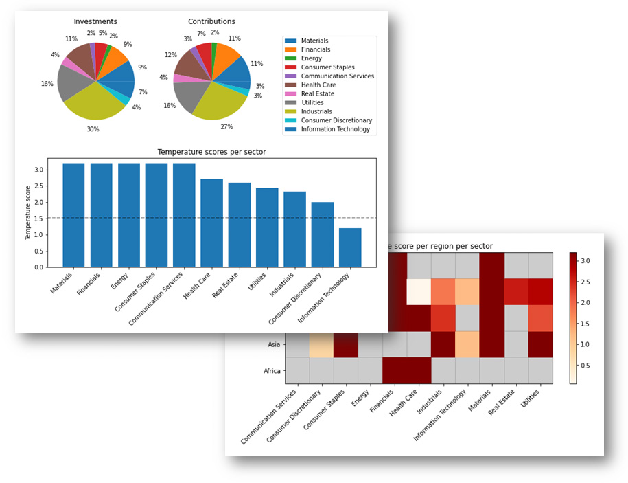
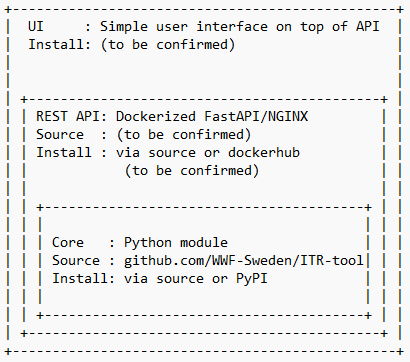

WWF Finance Tool for Temperature Scoring & Portfolio Coverage
==============================================================

*Do you want to understand what drives the temperature score of your
portfolio to make better engagement and investment decisions?*

|image1|

Based on the temperature scoring method, developed by CDP and WWF, this
tool helps companies and financial institutions to assess the
temperature alignment of current emission reduction targets,
commitments, and investment and lending portfolios. They can for
instance use this information to develop their own GHG emission
reduction targets for official validation by the Science Based Targets
initiative (SBTi), develop engagement strategies and help with strategic
security selection and allocation decisions.

This chapter provides a non-technical introduction and overview of what
the tool is for, the types of outputs it delivers, what data is
required, how it works, and where you can find more information and
documentation to start using the tool.

An introduction to the technical documentation
----------------------------------------------

The WWF Finance tool has been built as an open-source, data-agnostic
tool and works with input data from any data provider and in many
different IT infrastructures.

As such, the WWF Finance Tool for Temperature Scoring & Portfolio
Coverage can be used in several ways, depending on the specific
preferences of the user.

+-----------------------------------------------------------------------------------------------------------------------------------------------------------------------------------------------------------------------------------------------------------------------------------------------------+
| **Quickstart**                                                                                                                                                                                                                                                                                      |
|                                                                                                                                                                                                                                                                                                     |
| The tool is available as a python package on pypi, but the easiest way to test the tool is with notebooks:                                                                                                                                                                                          |
|                                                                                                                                                                                                                                                                                                     |
|                                                                                                                                                                                                                                                                                                     |
| -  **Python**: Run a Jupyter notebook, without any installation in \ `Google Colab <https://wwf-sweden.github.io/ITR-tool/getting_started.html#google-colab>`__ or `locally <https://wwf-sweden.github.io/ITR-tool/getting_started.html#jupyter-notebooks>`__.                                      |
|                                                                                                                                                                                                                                                                                                     |
| .. rubric::                                                                                                                                                                                                                                                                                         |
|    :name: section                                                                                                                                                                                                                                                                                   |
+-----------------------------------------------------------------------------------------------------------------------------------------------------------------------------------------------------------------------------------------------------------------------------------------------------+

If you are unsure whether the tool will be useful for your application
and workflow, or you would first like to run some examples to get a
better idea of how the tool works and what types of outputs it
generates, the `Analysis notebook (with abbreviated methodology) <https://colab.research.google.com/github//WWF-Sweden/ITR-tool/blob/main/examples/1_analysis_example.ipynb>`__
offers a quick and no-code opportunity for such testing. The notebook
combines text and code to provide a testing environment for your
research, to give you an understanding for how the tool can help you
analyze companies’ and portfolios’ temperature scores, to aid your
engagement and investment decisions.

The notebook is loaded with example data, but you can also use your own
data. For your first test, you can simply run the code cells one by one
in the current sequence, to get an understanding of how it works. If you
are not familiar with Notebooks, please refer to `this
introduction <https://colab.research.google.com/notebooks/basic_features_overview.ipynb>`__.

The following diagram provides an overview of the different parts of the
full toolkit and their dependencies: 

|image2|

As shown above, the Python code forms the core codebase of the
WWF Finance tool. It is recommended to use the Python package if the
user would like to integrate the tool in their own codebase. We are considering
providing an option to run the tool via an API if the user’s
preference is to include the tool as a Microservice in their existing IT
infrastructure in the cloud or on premise. This development project may also
include the creation of a simple user interface (UI), which can be used
for easier user interaction in combination with the API.

The ITR tool enables two ways of installing and/or running the
tool:  

1. Users can integrate the **Python package** in their codebase. For
   more detailed and up-to-date information on how to run the tool via
   the Python package, please consult the ‘Getting Started Using Python’
   section.

2. During the development of this tool, we have worked with several data
   and service providers to the financial and ESG markets, some who have
   or are in the process of implementing the tool and methodology into
   their commercial solutions. These providers include Bloomberg, CDP,
   ISS, MSCI, Ortec Finance, TruCost and Urgentem. Making use of their
   solutions can for some users be the easiest way to integrate the tool
   into existing infrastructure and workflow, to analyze portfolios’ and
   companies’ temperature scores.

Given the open source nature of the tool, the community is encouraged to
make contributions (refer to `Contributing <https://wwf-sweden.github.io/ITR-tool/contributing.html>`__ section to further develop
and/or update the codebase. Contributions can range from submitting a
bug report, to submitting a new feature request, all the way to further
enhancing the tool’s functionalities by contributing code.

.. toctree::
   :maxdepth: 4
   :caption: Contents:

   intro
   getting_started
   FunctionalOverview
   DataRequirements
   Legends
   contributing
   links
   terms
   